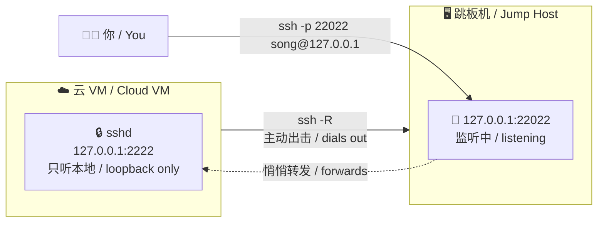
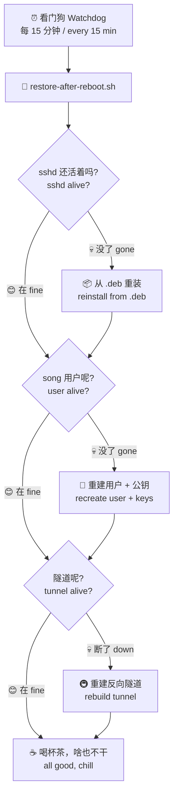

# 🚇 反向 SSH 隧道 Reverse SSH Tunnel

<p align="center">
  <b>让跳板机随时连回"与世隔绝"的云 VM！</b><br/>
  <i>Let your jump host reach back into an "unreachable" cloud VM!</i>
</p>

---

## 🤔 这是啥？ What Is This?

想象一下：你的云 VM 住在一个"只许出、不许进"的小区里 🏘️
Imagine your cloud VM lives in a gated community: **exit only, no visitors** 🏘️

平台把所有入站 SSH 全拦了，你想连进去？没门！
The platform blocks all inbound SSH. Want to connect in? Nope!

别慌，我们让 VM **主动打电话回家** 📞 ——
No panic! We make the VM **phone home** 📞 ——

它向一台有公网 IP 的跳板机建一条**反向隧道**，跳板机在本地开个端口，流量就乖乖流回 VM 啦。
It opens a **reverse tunnel** to a jump host with a public IP. The jump host listens on a local port, and traffic flows right back to the VM.

---

## 🗺️ 全景图 Architecture



登录姿势只有一种，又短又甜：
One-liner to get in, short and sweet:

```bash
# 在跳板机上执行 / run this on the jump host
ssh -p 22022 song@127.0.0.1
```

---

## 😱 为啥搞这么复杂？ Why So Fancy?

因为云 VM 有个"金鱼记忆" 🐠：
Because cloud VMs have the memory of a goldfish 🐠:

**重启 / 被平台替换后，`/root`、`/etc`、sshd、用户账号——全没了！**
**After a reboot or replacement, `/root`, `/etc`, sshd, user accounts — all gone!**

只有持久目录还活着。
Only the persistent directory survives.

所以我们的策略是：**把恢复材料钉死在持久目录 + 一个幂等的恢复脚本**，天塌了也能自己爬起来 💪
So the strategy: **pin recovery materials in the persistent dir + one idempotent restore script**. Even after doomsday, it picks itself back up 💪



---

## 🚀 三步上车 Quick Start

### 1️⃣ 准备"急救包" Prepare the First-Aid Kit

```bash
# 登录公钥，每行一个 / one pubkey per line
cat > ~/workspace/.ssh-pinned/song_authorized_keys <<'EOF'
ssh-ed25519 AAAA... you@example.com
EOF

# 跳板机 host key（IP 会变，key 不变，钉住它！）
# jump host key (IP changes, key doesn't — pin it!)
ssh-keyscan <跳板机IP> > ~/workspace/.ssh-pinned/jump_known_hosts
```

### 2️⃣ 改配置 Tweak the Config

打开 `restore-after-reboot.sh` 顶部的**配置区**，就 5 行：
Open the **config block** at the top of `restore-after-reboot.sh` — just 5 lines:

| 变量 Variable | 填啥 Value | 例子 Example |
|---|---|---|
| `JUMP_HOST` | 跳板机 `用户@地址` / jump host `user@host` | `root@8.137.117.134` |
| `TUNNEL_PORT` | 跳板机监听端口 / listen port | `22022` |
| `LOGIN_USER` | VM 登录用户名 / login user | `song` |
| `SSHD_PORT` | VM 的 sshd 端口 / sshd port | `2222` |
| `SSH_KEY` | VM 的私钥路径 / private key path | `~/.ssh/id_ed25519` |

### 3️⃣ 点火 Ignite 🔥

```bash
./restore-after-reboot.sh
```

第一次跑会自动把 sshd 主机密钥"钉"下来，以后重启 host key 不变，跳板机不用重新确认。
First run pins the sshd host keys — they won't change after reboots, no re-confirming on the jump host.

去跳板机验证一下：
Verify on the jump host:

```bash
ss -tln | grep 22022        # 看到 127.0.0.1:22022 就赢了 🎉 / you win!
ssh -p 22022 song@127.0.0.1 # 进去逛逛吧 / hop in!
```

---

## 📁 文件全家福 Meet the Family

| 文件 File | 人设 Role |
|---|---|
| `restore-after-reboot.sh` | 🦸 主角！幂等恢复脚本，天塌了它先上 / the hero |
| `watchdog.md` | 🐶 看门狗值班表：每 15 分钟巡逻一次 / patrol roster |
| `docs/setup.md` | 📖 新人入职手册：从零搭建全流程 / onboarding guide |
| `ssh-pinned/*.example` | 📝 模板：照着填你的真实密钥（真实文件不进仓库！）/ templates (real keys never enter the repo!) |
| `.gitignore` | 🛡️ 保镖：密钥文件休想混进 git / bouncer |

---

## 🔒 安全小抄 Security Notes

- 🙈 **仓库里没有任何真实密钥** —— 只有 `.example` 模板，`.gitignore` 守门
  **No real secrets in this repo** — only `.example` templates, guarded by `.gitignore`
- 🏠 隧道两端都是 `127.0.0.1` 监听，公网扫描器看都看不见
  Both tunnel ends listen on `127.0.0.1` — invisible to port scanners
- 🚫 sshd 禁密码、禁 root，只认公钥
  sshd: no passwords, no root, pubkey only
- 🔑 退出码 `2` = 隧道重建失败（多半是平台要你审批新的出站 SSH），别重试，找主人去！
  Exit code `2` = tunnel rebuild failed (usually needs your approval for a new outbound SSH) — don't retry, go find the human!

---

## 🆘 救命 FAQ

**Q: 隧道连上了但 ssh 进不去？/ Tunnel is up but I can't ssh in?**

A: 先看跳板机 `ss -tln | grep 22022` 有没有监听；再看 `song` 用户的 `~/.ssh/authorized_keys` 权限是不是 600。
Check `ss -tln | grep 22022` on the jump host first; then make sure `~/.ssh/authorized_keys` is mode 600.

**Q: VM 被平台替换了怎么办？/ What if the VM gets replaced?**

A: 喝杯茶 ☕。看门狗 15 分钟内自动重建一切。等不及？手动跑一遍 `restore-after-reboot.sh`。
Grab a tea ☕. The watchdog rebuilds everything within 15 minutes. Impatient? Run `restore-after-reboot.sh` manually.

**Q: 能用在别的云平台吗？/ Works on other cloud platforms?**

A: 能！只要满足两点：VM 能出站 SSH、有台能入站 SSH 的跳板机。改 5 行配置就行。
Sure! Two requirements: the VM can SSH out, and you have a jump host you can SSH into. Just tweak the 5 config lines.

---

<p align="center">
  用 ❤️ 和一点点偏执做成<br/>
  Made with ❤️ and a healthy dose of paranoia
</p>
